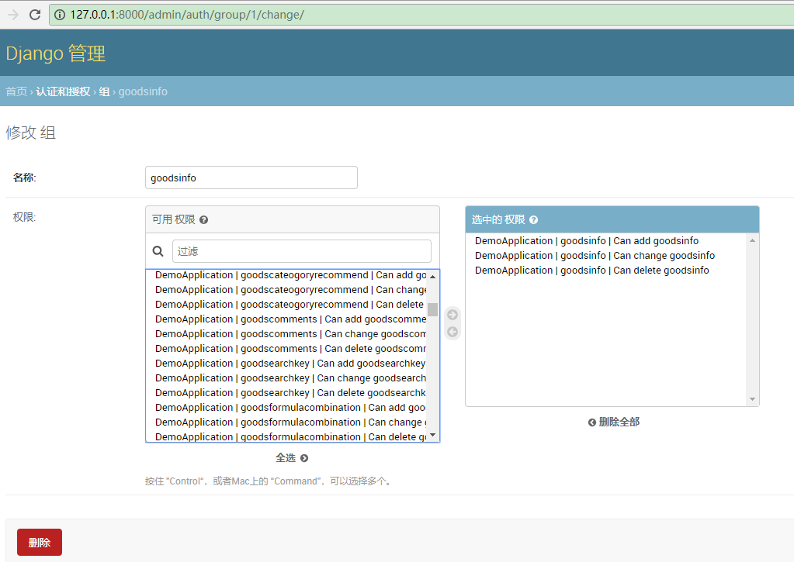
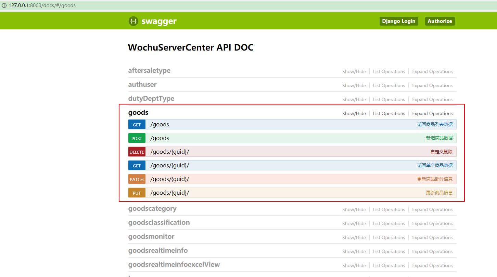
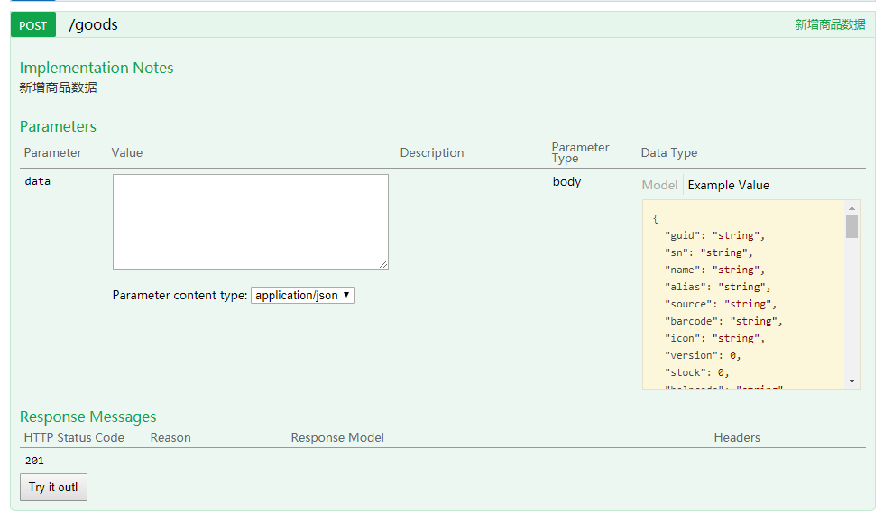
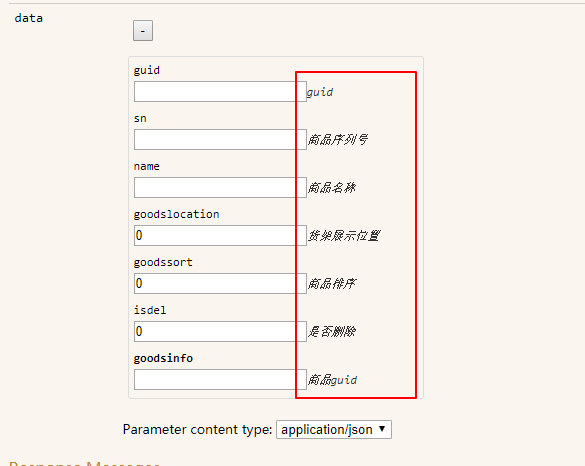
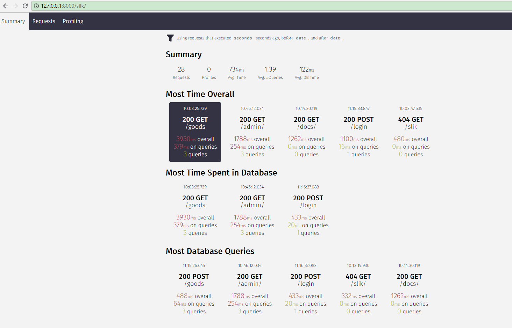
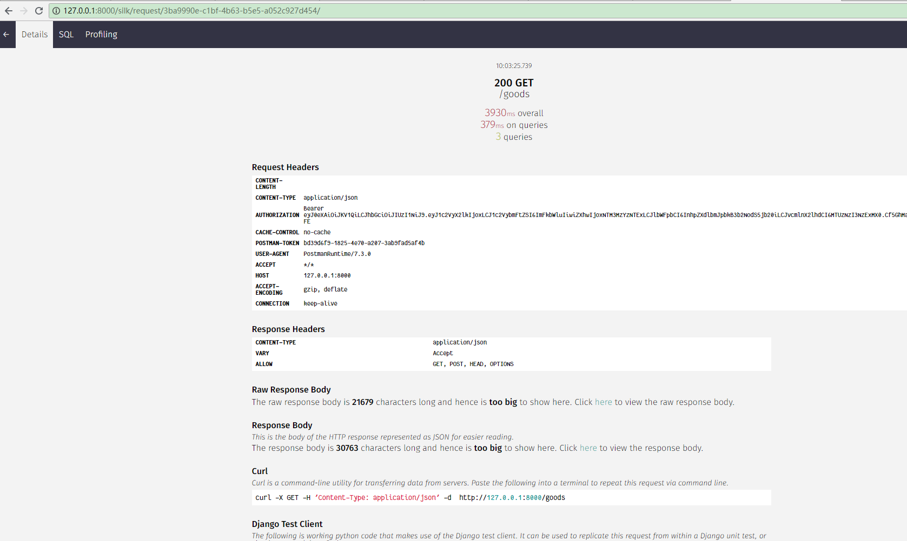
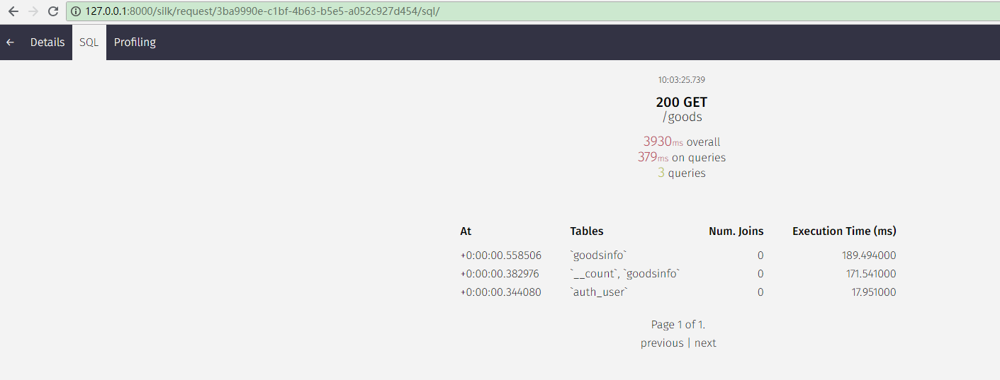

# 我厨整体服务中心

## 安装与运行
安装依赖包

    pip3 install requirements.txt
    
创建日志目录
    mkdir -p log/request
    mkdir -p log/scripts
    mkdir -p log/error
    

启动服务

    uwsgi --http :8001 --wsgi-file ./WochuServerCenter/wsgi.py  
    或  
    uwsgi --ini uwsgi.ini

停止服务
  
    uwsgi --stop uwsgi.pid

## 新增功能
### 1. 数据库新增读写分离模式  
通过模型类using来调用读写分离

        def get_queryset(self):  
            if self.action in ['list', 'retrieve']:  
                return Goodsinfo.objects.using('read').all()  
            else:  
                return Goodsinfo.objects.all()  
                
### 2.增加api限速功能  
通过setting中来配置匿名用户和用户的访问频率

    'DEFAULT_THROTTLE_RATES': {
        'anon': '2/day',
        'user': '5/minute',  # 测试用
    },
[限速参考资料:http://www.django-rest-framework.org/api-guide/throttling/](http://www.django-rest-framework.org/api-guide/throttling/)
    
### 3.增加了api中的选择字段、排序、分页功能  
访问url如下:  
http://127.0.0.1:8000/goods?&fields=name,sn,price&ordering=price&page=3&page_size=4  
其中  
fields 控制需要返回的字段  
ordering 控制需要排序的字段  
page  控制需要获取的页数  
page_size 控制每页显示的记录数

    返回结果如下：
    {
    "info": "查询成功",
    "code": 200,
    "data": [
        {
            "sn": "WOC000177777",
            "name": "5000元",
            "price": null
        },
        {
            "sn": "WOC000006151",
            "name": "Mayer美亚不粘锅26cm*5.7cm",
            "price": "0.00"
        },
        {
            "sn": "WOC000003852",
            "name": "儿童沙滩玩具（赠品）",
            "price": "0.00"
        },
        {
            "sn": "WOC000009035",
            "name": "豆瓣酱（生活馆员工餐）",
            "price": "0.00"
        }
    ],
    "page": 8609
    }  
    
增加了自定义商品价格过滤器 GoodinfoPriceFilter  
http://127.0.0.1:8000/goods?fields=name,price&min_price=19.9&max_price=25

[过滤器参考资料:https://django-filter.readthedocs.io/en/master/](https://django-filter.readthedocs.io/en/master/)
[动态字段参考drf-dynamic-fields](https://github.com/dbrgn/drf-dynamic-fields)
### 4.增加自定义模型视图集 MyAbstractModelViewSet  
3中的自定义字段、排序、限速等功能已经集成在了该类中  
通过改写视图集中的方法来实现不同的功能  

实现了 MyAbstractModelViewSet2 与 my_custom_exception_handler 相结合  
让返回标准化为: 

    {"data"{"pagedata":数据,"pagination":分页头信息},
      "message":返回信息,
      "status": ok or fail,
      "code": 响应代码}

### ~~5.修复了Admin站点与Login接口登陆时密码不一致问题~~  
~~原先login接口密码使用了明文记录在数据库中现已修复~~  
此问题暂时不予修复

### ~~6.增加了MyAbstractModelViewSet权限控制功能~~  
~~通过admin站点的用户和组来控制用户对某个模型类的权限~~ 
  
~~没有权限的用户将收到403响应~~  

    {
    "status": "fail",
    "code": 403,
    "message": "您没有执行该操作的权限。"
    }
此问题暂时不予修复
[权限参考资料:http://www.django-rest-framework.org/api-guide/permissions/](http://www.django-rest-framework.org/api-guide/permissions/)  
### 7.增加了自动文档功能  
http://127.0.0.1:8000/doc
  
  
完善了参数描述功能  

[自动化文档参考资料:](http://www.django-rest-framework.org/topics/documenting-your-api/) 

### ~~8.新增性能检测工具~~  
由于该功能对性能有所损耗且要迁移数据库表,故取消该功能  
http://127.0.0.1:8000/silk  
  
  
  
[性能检测参考资料https://github.com/jazzband/django-silk](https://github.com/jazzband/django-silk)

### 9.搜索
'^' Starts-with search.

'=' Exact matches.

'@' Full-text search. (Currently only supported Django's MySQL backend.)

'$' Regex search

    For example:

        search_fields = ('=username', '=email')
        
 搜索时使用的url如下：  
 http://127.0.0.1:8000/goods?fields=name&search=鱼

### 参考资料
[Django REST framework的一些奇巧淫技(干货!!!)](https://www.jianshu.com/p/f3606a5def69)  
[Django 基础教程](https://code.ziqiangxuetang.com/django/django-tutorial.html)  